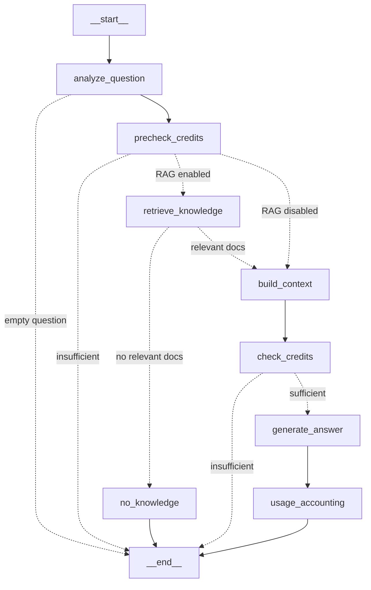

# Architecture

This document describes the current system and the **target** architecture. Components marked
**NOT IMPLEMENTED** are shown to guide later steps.

## Request flow: LangGraph chat workflow (implemented, Step 5)

```
React
  ↓
FastAPI                  routes/chat.py: validation, user placeholder, HTTP mapping
  ↓
ChatService              invokes the compiled graph, maps final state → response / errors
  ↓
LangGraph (chat_graph)   orchestration only
  |
  +--> Analyze Question        normalise; empty → END (422)
  |
  +--> Precheck Credits        cheap check on the question; insufficient → END (402)
  |
  +--> Retrieve Knowledge      KnowledgeRetriever
  |        ↓
  |      Qdrant
  |        └── no relevant chunks → No Knowledge → END (controlled answer, no LLM, no charge)
  |
  +--> Build Context           RAGContextBuilder (numbered sources + grounding instructions)
  |
  +--> Check Credits           accurate check on the full prompt; insufficient → END (402)
  |
  +--> Generate Answer         LLMProvider
  |        ↓
  |      OpenAI
  |
  +--> Usage Accounting        UsageMeter
  ↓
Cost / Credits           PricingService → CreditPolicy
  ↓
Database                 UsageService (ledger row + deduction, one transaction)
```

### Graph definition (`app/graph/builder.py`)



| Node | Uses (existing service) | Writes to state |
|------|--------------------------|-----------------|
| `analyze_question` | none (no LLM call) | `question`, `retrieval_query`, `use_retrieval`, `answer_type`, or `status=invalid_question` |
| `precheck_credits` | `UsageMeter.ensure_can_afford` on the bare question | `status=insufficient_credits` if it fails |
| `retrieve_knowledge` | `KnowledgeRetriever.search` (top-k), then the relevance threshold | `retrieved_documents`, `relevant_documents`, `retrieval_latency_ms`, `query_tokens`, `status=no_knowledge` |
| `no_knowledge` | `UsageMeter.remaining_credits` | controlled `assistant_message`, zero usage/cost |
| `build_context` | `group_by_document`, `RAGContextBuilder` | `context` (instructions + input), `sources` |
| `check_credits` | `UsageMeter.ensure_can_afford` on the full prompt | `status=insufficient_credits` if it fails |
| `generate_answer` | `LLMProvider.generate` | `assistant_message`, `model`, `usage` (provider-reported), `llm_latency_ms` |
| `usage_accounting` | `UsageMeter.record` → PricingService → CreditPolicy → UsageService | `cost`, `credits_consumed`, `credits_remaining`, `status=answered` |

Every node appends its name to `graph_path` (a reducer-backed list), so the path taken is part of
the state.

**State vs context.** `ChatState` (`app/graph/state.py`, a `TypedDict`) holds only data flowing
through the workflow. Services (retriever, context builder, LLM provider, usage meter with its
request-scoped DB session) and settings are passed per invocation through LangGraph's runtime
context (`context_schema=ChatGraphContext`, read by nodes via `runtime.context`). The graph is
compiled **once** (`get_chat_graph()`, cached) and shared across requests.

**Expected outcomes vs failures.**
- Empty question, no relevant knowledge and insufficient credits are expected outcomes. They set
  `status` and are routed explicitly to `END`. `ChatService` turns `invalid_question` into 422 and
  `insufficient_credits` into 402.
- Infrastructure failures raise the existing typed `AppError`s from inside a node: Qdrant down or
  collection missing (503), embedding errors (502/503), LLM timeout (504), provider error (502).
  Database errors in `usage_accounting` raise `SQLAlchemyError` and map to 503. An exception stops
  the graph, so no later node runs: **an LLM failure never reaches `usage_accounting`, and no
  credits are deducted**. The API error handlers produce `{"error": {code, message}}`, and raw
  provider errors never reach the client.

`RAG_ENABLED=false` routes `precheck_credits → build_context` (direct prompt, no retrieval).
`RAG_NO_CONTEXT_MODE=llm` routes "no relevant docs" to `build_context` with the no-context prompt
instead of the `no_knowledge` node.

### Why LangGraph

The Step 4 `RAGService` did the same work in straight-line code. It was replaced (not wrapped)
by the graph because:

- **Explicit state.** Everything a turn knows (question, retrieved chunks, context, usage, cost) is
  a typed state object, not locals scattered across services.
- **Deterministic workflow.** Fixed nodes and edges; no LLM decides the control flow.
- **Conditional routing.** Branches such as "no relevant knowledge", "insufficient credits" and
  "RAG disabled" are visible edges rather than early returns buried in a method.
- **Extensibility.** Upcoming features map onto nodes and edges: topic detection (a node after
  `analyze_question`), context switching and summarisation/compression (nodes before
  `build_context`), retrieval decisions (routing before `retrieve_knowledge`), and token-budget
  decisions (the credit-check nodes).
- **Observability.** Per-node timing and outcome logs plus the recorded `graph_path` make a
  multi-step LLM turn easy to follow.

LangGraph provides **only orchestration**. Retrieval (Retriever + Qdrant), LLM inference
(LLMProvider + OpenAI), prompt construction (RAGContextBuilder) and token/cost/credit accounting
(UsageMeter, PricingService, CreditPolicy, UsageService) remain our own services, unchanged.
LangGraph is used without LangChain models, retrievers or prompts. `langchain-core` is installed
only as a transitive dependency of `langgraph`.

### RAG configuration

| Variable | Default | Notes |
|----------|---------|-------|
| `RAG_ENABLED` | `true` | `false` means direct LLM chat (graph skips retrieval) |
| `RAG_TOP_K` | `5` | Chunks retrieved per question (1 to 20) |
| `RAG_MIN_RELEVANCE_SCORE` | `0.30` | Cosine similarity; blank disables filtering. Calibrated for `text-embedding-3-small` on this knowledge base: 13 in-domain questions scored 0.31–0.76 top-1, and 10 out-of-domain questions scored at most 0.27. **Re-calibrate if the embedding model or corpus changes.** |
| `RAG_NO_CONTEXT_MODE` | `fixed_response` | or `llm` |
| `RAG_NO_CONTEXT_MESSAGE` | (text) | Reply used by the `no_knowledge` node |
| `RAG_DEBUG` | `false` | Adds graph path, latencies and retrieved chunks to chat responses and the UI |

### Module responsibilities

| Module | Responsibility |
|--------|---------------|
| `api/v1/routes/*` | HTTP only |
| `api/deps.py` | Builds services and the per-request `ChatGraphContext`. `get_current_user_id` is the future auth seam (returns `dev-user`). |
| `api/errors.py` | `AppError`, `SQLAlchemyError` and unexpected errors to `{"error": {code, message}}` |
| `services/chat_service.py` | Invokes the compiled graph, logs start/end, maps final state to response or errors |
| `graph/state.py` | `ChatState` TypedDict (data only) |
| `graph/context.py` | `ChatGraphContext` (services) and `ChatGraphSettings` (per-request runtime context) |
| `graph/nodes.py` | Node functions and routing functions (orchestration only) |
| `graph/builder.py` | `create_chat_graph()` / cached `get_chat_graph()` |
| `rag/context_builder.py` | `RAGContextBuilder`: the only place prompt text lives |
| `rag/sources.py` | Deduplicates chunks into one `SourceReference` per article |
| `knowledge/retriever.py` | Retrieval only (Step 3, unchanged) |
| `services/llm/` | `LLMProvider` Protocol, `OpenAIProvider`, mock |
| `services/metering.py` | `UsageMeter`: affordability check and metering of actual usage |
| `services/pricing.py` | `MODEL_PRICING` catalog and `PricingService` |
| `services/credits.py` | `CreditPolicy` (USD to credits) |
| `services/usage_service.py` | Ledger writes, balance checks, usage summary |
| `core/request_context.py` | `X-Request-ID` middleware; the ID is attached to every log line of the request |
| `db/` | SQLAlchemy models, `DecimalAmount` column type, sessions, Alembic runner |

## Tokens vs cost vs credits

These three quantities are **intentionally separate**:

| Concept | Unit | Source of truth | Example |
|---------|------|-----------------|---------|
| **LLM tokens** | tokens (input and output counted separately) | Reported by the provider per request | 120 in / 180 out |
| **LLM cost** | USD | `tokens x model price` (`PricingService`, USD per 1M tokens) | $0.000336 |
| **Application credits** | credits | `cost x CREDITS_PER_DOLLAR` (`CreditPolicy`) | 0.336 credits |

Why they are separate:

- **Tokens are not comparable across models.** A `gpt-5-mini` output token costs 20x a
  `gpt-4.1-nano` input token. Charging "1 credit = 1 token" would make the budget meaningless when
  the model changes.
- **Input and output are priced differently.** Output is typically 4 to 8 times more expensive, so
  totals must be priced per direction.
- **Credits are a product decision, cost is a vendor fact.** Keeping a conversion layer lets the
  product add margin, run promotions, change providers or absorb vendor price changes without changing
  user budgets or historical ledger data. The ledger stores all three values per request.

### Pricing unit and precision

- Prices are **USD per 1,000,000 tokens**, stored as `Decimal` in `MODEL_PRICING`. Input and output
  prices are separate per model. To add a model, add one catalog entry. Dated snapshot names such as
  `gpt-4.1-mini-2025-04-14` resolve to the base entry.
- All money and credit values are `Decimal`, quantized to 12 decimal places. No `float` is used
  anywhere in the pipeline.
- Storage uses `DecimalAmount`: `NUMERIC(38,12)` on PostgreSQL and a scaled `BIGINT` on SQLite (which
  has no exact decimal type), so `SUM()` is exact on both.
- The API returns amounts as decimal strings (`"0.000336"`) so JSON clients don't round them.
- Catalog prices are list prices; verify them against OpenAI's pricing page. Cached-input and batch
  discounts are not yet modelled.

## Data model (implemented)

- `users`: `id`, `total_credits`, `credits_used`, `created_at`. Remaining = total − used.
- `usage_records` (append-only): `user_id`, `conversation_id`, `created_at`, `provider`, `model`,
  `provider_request_id`, `input_tokens`, `output_tokens`, `total_tokens`, `input_cost`, `output_cost`,
  `total_cost`, `credits_consumed`, `latency_ms`.

Migrations are managed by Alembic (`backend/migrations`).

## Known limitations (by design for this step)

- **Check-then-deduct is not strictly atomic.** Concurrent requests can each pass the pre-check and
  push the balance slightly negative. The deduction itself never loses updates. Future options: a
  guarded `UPDATE ... WHERE total_credits - credits_used >= :x`, or a reserve-then-settle hold.
  Distributed locking is deliberately deferred.
- Actual usage can exceed the pre-flight estimate for unusually tokenized input. The actual cost is
  always charged.
- Only the current question (plus retrieved context) is sent to the LLM. There is no conversation
  history yet, so follow-up questions like "and how does it scale?" are not resolved.
- The graph runs synchronously in FastAPI's threadpool (`graph.stream`, sync nodes). There is no
  checkpointer: graph state lives only for one request, and nothing is persisted between turns.
- The query-embedding cost of retrieval (about 10 tokens, roughly $0.0000002) is logged but not
  charged to user credits. Only LLM usage is metered.
- Chunks overlap by up to 200 characters, so adjacent chunks of one article can repeat a little text
  in the prompt.
- Sync route + sync SDK/DB, run in FastAPI's threadpool. This is fine at this scale. It can move to
  async clients later without changing the provider interface's shape.

## Observability

Every request gets an `X-Request-ID` (a well-formed incoming one is reused, otherwise one is
generated). It is echoed in the response header and attached as `request_id` to every log line
written while handling the request, including every graph node.

Per chat turn:

| Event | Fields |
|-------|--------|
| `chat_graph_start` | `conversation_id` |
| `graph_node` (one per node) | `node`, `outcome` (`ok`/`failure`), `duration_ms`, `error_code`/`error_type` on failure, plus node metrics: `retrieved`, `relevant`, `top_score`, `retrieval_latency_ms` (retrieve); `sources`, `prompt_chars` (build_context); `sufficient` (credit checks); `model`, `llm_latency_ms`, `input_tokens`, `output_tokens` (generate); `total_cost_usd`, `credits_consumed` (usage) |
| `chat_graph_end` | `graph_path` (`a>b>c`), `status`, `outcome` (`success`/`rejected`/`failure`), retrieval and LLM metrics, tokens, cost, credits, `provider_request_id`, `latency_ms` |

The retriever also logs `knowledge_search` (query-embedding tokens and latency). Output is `key=value`
by default or JSON lines with `LOG_JSON=true`. **Never logged:** API keys, prompts, retrieved text,
user questions or answers.

## Knowledge base: ingestion + retrieval (implemented, Step 3)

> Since Step 4 this retriever also powers RAG in `/chat` (see above). The development search endpoint
> and UI remain for inspecting retrieval without calling the LLM.

```
             Knowledge Sources
                   |
             Wikipedia API              ingestion/sources/wikipedia.py (MediaWiki Action API, plain-text extracts)
                   |
                   ↓
                Document                app/knowledge/models.py (source-agnostic)
                   |
                   ↓
            Cleaner + Chunker           ingestion/cleaning.py, ingestion/chunking.py
                   |
                   ↓
             Embedding Provider         app/knowledge/embeddings.py (Protocol) -> openai_embeddings.py
                   |
                   ↓
                 Qdrant                 app/knowledge/vector_store.py (Protocol) -> qdrant_store.py
                   |
                   ↓
               Retriever                app/knowledge/retriever.py (query -> embedding -> vector search)
                   |
                   ↓
         Knowledge Search API           POST /api/v1/knowledge/search (dev only, no LLM)
```

Runtime topology for local development:

```
FastAPI ──┬── SQLite   (users, usage ledger)
          └── Qdrant   (knowledge vectors; docker compose up -d qdrant)
ingestion CLI ──► Wikipedia API, OpenAI embeddings, Qdrant
```

### Independence of concerns

| Concern | Module | Knows about |
|---------|--------|-------------|
| Knowledge source | `ingestion/sources/*` (`KnowledgeSource` Protocol) | Wikipedia only |
| Document processing | `ingestion/cleaning.py` | text |
| Chunking | `ingestion/chunking.py` | `Document` to `Chunk` |
| Embedding | `app/knowledge/*embeddings.py` (`EmbeddingProvider`) | OpenAI SDK only in `openai_embeddings.py` |
| Vector storage | `app/knowledge/*store.py` (`VectorStore`) | `qdrant_client` only in `qdrant_store.py` |
| Retrieval | `app/knowledge/retriever.py` | the two Protocols above |
| LLM | `app/services/llm/*` | unaware of the knowledge base (for now) |

`ingestion/` is a separate package and CLI. It imports the backend package (installed editable) so
models, embeddings and the vector store have exactly one implementation, shared with the API.

### Key decisions

- **Wikipedia via the official API.** `action=query&prop=extracts&explaintext=1` returns clean text
  with `== Heading ==` markers, with no HTML scraping. Disambiguation pages are rejected. Requests are
  spaced at 1 per second and retry 429/503 with `Retry-After`. The first live run hit HTTP 429 without
  this.
- **Document IDs** are `wikipedia:{lang}:{page_id}`, stable across title changes and redirects.
- **Chunking** uses characters rather than tokens: paragraph → sentence → word splitting, greedy
  packing to `CHUNK_SIZE`, with `CHUNK_OVERLAP` carried over. It is simple, deterministic and
  model-independent. Defaults are 1200/200, about 300 tokens per chunk.
- **Vector dimension comes from the embedding model, never a hard-coded constant.**
  `resolve_dimension()` maps known models to their native size (`text-embedding-3-small` is 1536,
  `-3-large` is 3072). `OPENAI_EMBEDDING_DIMENSIONS` can request a smaller size (3-series only). An
  unknown model requires an explicit dimension. The collection is created with that size and cosine
  distance (OpenAI embeddings are normalised). If an existing collection has a different size,
  ingestion and search fail with an actionable error instead of corrupting data. Switching models
  therefore means a new `QDRANT_COLLECTION` or `--recreate`.
- **Idempotent ingestion.** Point ID = `uuid5(document_id#chunk_index)`. Re-ingesting upserts in
  place, then deletes chunks with a higher index than the new count. Each point stores a fingerprint of
  text, chunking config and embedding model, and unchanged documents are skipped before any embedding
  call, so re-runs cost nothing.
- **Batching.** Embeddings use up to `EMBEDDING_BATCH_SIZE` (100) inputs per API call. Qdrant upserts
  in batches of 256.
- **Costs are visible.** Embedding tokens are provider-reported, and ingestion prints the embedding
  cost using the same `PricingService` as chat. Query embeddings on the dev search endpoint are
  logged but **not** charged to user credits.
- **Partial failure.** A per-article error is recorded and the run continues. Errors that would fail
  every article (no API key, Qdrant down, dimension mismatch) abort with a hint. The CLI exits 0, 1 or
  2.

### Qdrant payload

`text`, `document_id`, `chunk_id`, `chunk_index`, `source`, `article_title`, `source_url`,
`fingerprint`, and `metadata` (`page_id`, `revision_id`, `requested_title`, `language`, `fetched_at`,
`chunk_count`). Payload indexes: `document_id`, `source` (keyword), `chunk_index` (integer).

### Error mapping (knowledge endpoints)

| Condition | HTTP | Code |
|-----------|------|------|
| Qdrant unreachable | 503 | `vector_store_unavailable` |
| Collection not created yet | 503 | `knowledge_base_not_ready` |
| Collection/model dimension mismatch | 500 | `vector_store_misconfigured` |
| Missing/invalid OpenAI key or model | 503 | `embedding_not_configured` |
| OpenAI embedding failure/timeout | 502 | `embedding_provider_error` |

## Target overview

```
User
 ↓
FastAPI
 ↓
LangGraph                         [IMPLEMENTED, Step 5: deterministic chat_graph]
 ├── Context Manager              [NOT IMPLEMENTED: topic switching, summarisation, compression]
 ├── Retriever                    [IMPLEMENTED, retrieve_knowledge node]
 │      ↓
 │    Qdrant                      [IMPLEMENTED]
 └── LLM                          [IMPLEMENTED]
 ↓
Response
 ↓
Token Metering → Credits          [IMPLEMENTED]

Deployment: WAF → ALB → ECS/Fargate, RDS, managed Qdrant, Redis   [NOT IMPLEMENTED]
```

## Components

| Component | Status | Notes |
|-----------|--------|-------|
| React chat UI + usage indicator | IMPLEMENTED | Refreshes `/usage` after each chat request |
| React knowledge search (dev) | IMPLEMENTED | `#/dev/knowledge`, dev builds only |
| FastAPI `/health`, `/chat`, `/usage`, `/knowledge/search` | IMPLEMENTED | |
| `LLMProvider` + OpenAI + mock | IMPLEMENTED | Selected by `LLM_PROVIDER` |
| Pricing, credits, usage ledger | IMPLEMENTED | Described above |
| Relational DB | IMPLEMENTED (SQLite) | PostgreSQL/RDS later via `DATABASE_URL` |
| Authentication | NOT IMPLEMENTED | Fixed `dev-user` |
| Conversation history | NOT IMPLEMENTED | |
| Embedding provider abstraction + OpenAI | IMPLEMENTED | `app/knowledge/` |
| Vector store (Qdrant) | IMPLEMENTED | Local via Docker. Qdrant Cloud or self-hosted on AWS later. |
| Wikipedia ingestion CLI | IMPLEMENTED | `ingestion/` |
| Retriever + dev search API/UI | IMPLEMENTED | |
| RAG in `/chat` (grounded answers, sources, no-context handling) | IMPLEMENTED | Step 4 |
| React sources + debug panel (graph path, retrieval) | IMPLEMENTED | Debug only with `RAG_DEBUG=true` |
| Conversation history / context management | NOT IMPLEMENTED | Topic switching, summarisation, compression |
| LangGraph orchestration (`chat_graph`) | IMPLEMENTED | Step 5; deterministic, no checkpointer |
| Topic detection / switching, summarisation, compression, long-term memory | NOT IMPLEMENTED | Future graph nodes |
| Streaming (SSE/WebSocket) | NOT IMPLEMENTED | |
| Redis | NOT IMPLEMENTED | Caching, rate limiting, distributed state |
| AWS (ECS/Fargate, ALB, WAF, RDS) | NOT IMPLEMENTED | `infrastructure/` |

## Design principles

- **Loose coupling via interfaces.** Vendor SDKs are confined to one provider module.
- **Thin routes, logic in services.** Dependencies are injected with FastAPI `Depends` and overridden in tests.
- **Exact money.** `Decimal` everywhere, exact storage, string serialization.
- **Stateless API containers.** State lives in the database, so the API can scale horizontally.
